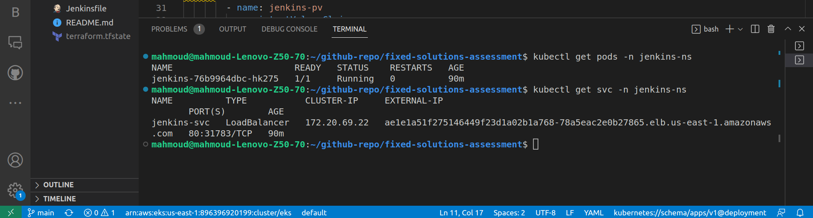

# fixed-solutions-assessment
Create EKS using Terraform infrastructure and jenkins deployment to Deploy a Python web application on EKS using CI/CD Jenkins Pipeline using the following steps and high-level diagram:
1. Implement a secure EKS Cluster
2. Deploy and configure Jenkins on EKS
3. Deploy the backend application on EKS using the Jenkins pipeline

### video for my demo project
https://drive.google.com/file/d/1AKsDqiT3QgJHHQatLtKGI_FN1-QjB2aO/view?usp=sharing

### Used Tools
 

##### Terraform          
Infrastructure as a code to execute the app Infrastructure.


##### Jenkins            
An open source automation server which we will use to build, test, and deploy our app or software.


##### Docker             
 The platform which we use to build the app image.


##### Kubernates         
 Kubernetes automates operational tasks of container management.


##### AWS               
The Amazon Web Services provider which we will use it through our project.

### provision infrastructure using terraform
```
terraform init
```
```
terraform plan
```
```
terraform apply
```


### Check pods and Services To Get URL For Jenkins


### Get Jenkins Password Connect
```
kubectl exec --namespace jenkins-ns -it svc/jenkins-svc -c jenkins -- /bin/cat /var/jenkins_home/secrets/initialAdminPassword && echo
```
### SSH to the node and install docker daemon.
```
ssh -i "iti.pem" ec2-user@3.86.209.161
```
```
sudo yum update -y
```
```
sudo yum install -y docker
```
```
sudo service docker start
```
```
sudo systemctl enable docker.service
```
### Install Plugin And Create Your Admin User In Jenkins
## Now you are ready to use Jenkins on a EKS cluster! 🚀

## THEN Deploy a backend appliciation on kubernetes cluster using CI/CD jenkins pipeline

### Create Jenkins Credentials Configurations:
 - Create a username and password Credential for your Dockerhub account.
 

 ### Dockerfile
Created a Dockerfile to Dockerize My Python App

### Jenkinsfile
Created a Jenkinsfile with continuous integration (CI) and continuous deployment (CD) stages

#### CI stage:
- Building the image with a version number equals to the Jenkins build number. 
- Passing the Dockerhub credentials in order to login.
- Pushing the new image to Dockerhub.

BUILD_NUMBER is an environment variable.

#### CD stage:
- Replacing the "tag" in the deployment file with the new BUILD_NUMBER (version).
- Deploying the app with kubectl.

### Create New Pipeline With Pipeline script from SCM

- Choose type for SCM (Git) , Put Your Repository Link
- If The Repo Private We Need Add Credential Github Username And Password
- Check Branch Name In Your Repo


#### GitHub Webhook

Changing the pipeline configurations by activating the "GitHub hook trigger for GITScm polling".


From GitHub -->
- Add a webhook.
- Add the jenkins URL/github-webhook/ to the Payload URL.


### Check pods and Service To Get URL For application


### The application is successfully deployed!🚀 


## Final Part: Clean up 💣
```
terraform destroy 
```
